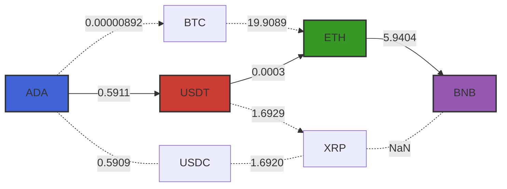
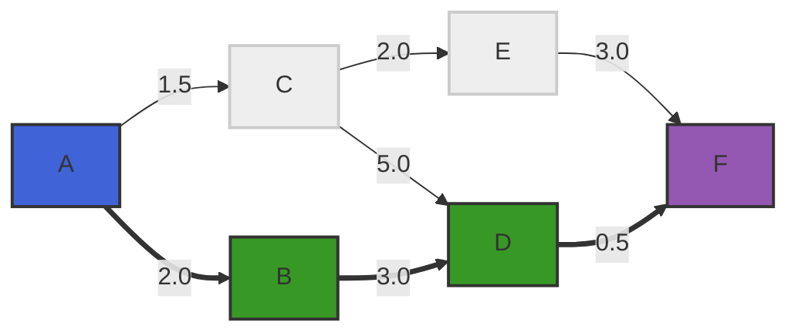

# CcyConv.jl

[](https://bhftbootcamp.github.io/CcyConv.jl/stable/)
[](https://bhftbootcamp.github.io/CcyConv.jl/dev/)
[](https://github.com/bhftbootcamp/CcyConv.jl/actions/workflows/Coverage.yml?query=branch%3Amaster)
[](https://codecov.io/gh/bhftbootcamp/CcyConv.jl)
[](https://github.com/bhftbootcamp/Green)

CcyConv is a Julia package for performing currency conversions. It allows for direct and multi-step conversions using the latest exchange 💱 rates.

## Installation
If you haven't installed our [local registry](https://github.com/bhftbootcamp/Green) yet, do that first:
```
] registry add https://github.com/bhftbootcamp/Green.git
```

To install CcyConv, simply use the Julia package manager:

```julia
] add CcyConv
```

## Usage

Here's how you can find a conversion path from `ADA` to `BNB`:



```julia
using CcyConv

crypto = FXGraph()

append!(
    crypto,
    [
        Price("ADA", "USDT", 0.5911),
        Price("ADA", "BTC", 0.00000892),
        Price("BTC", "ETH", 19.9089),
        Price("USDT", "ETH", 0.0003),
        Price("ETH", "BNB", 5.9404),
        Price("USDT", "XRP", 1.6929),
        Price("XRP", "BNB", NaN),
        Price("USDC", "XRP", 1.6920),
        Price("ADA", "USDC", 0.5909),
    ],
)

result = conv(crypto, "ADA", "BNB")

julia> conv_value(result)
0.0010534111319999999

julia> conv_chain(result)
3-element Vector{CcyConv.AbstractPrice}:
 Price("ADA",  "USDT", 0.5911)
 Price("USDT", "ETH",  0.0003)
 Price("ETH",  "BNB",  5.9404)
```

### Min rate paths

By default, `conv` uses state-space A* (`AStar`) over `log(rate)`-weighted edges: search states are `(currency, visited_set)` pairs, so every walk in the lifted graph is a simple path in the original by construction. This returns the same minimum-rate answer as `DFS` on every graph (including those with arbitrage cycles), with a min-edge-weight admissible heuristic pruning branches that cannot improve the best path found so far. Worst-case runtime is `O(V * 2^V)` (the problem is NP-hard in general); in practice it beats the exhaustive DFS on most inputs. For graphs with more than 64 currencies the implementation falls back to DFS.
`DFS` performs an exhaustive search over all simple paths (no vertex is visited twice) using depth-first search with backtracking to find the path with the minimum product of exchange rates.



```julia
using CcyConv

fx = FXGraph()

append!(
    fx,
    [
        Price("A", "B", 2.0),
        Price("B", "D", 3.0),
        Price("D", "F", 0.5),
        Price("A", "C", 1.5),
        Price("C", "D", 5.0),
        Price("C", "E", 2.0),
        Price("E", "F", 3.0),
    ],
)

julia> conv(fx, "A", "F", DFS()) |> conv_value
3.0  # A → B → D → F (2.0 × 3.0 × 0.5)
```

### Custom context

The graph topology can be built upfront — without actual prices — and the rates resolved lazily at query time through a custom context. This lets you fetch and cache live data from any source on the fly.

```julia
using CcyConv
using EasyCurl
using Serde

struct BinanceCtx <: CcyConv.AbstractCtx
    prices::Dict{String,Float64}

    BinanceCtx() = new(Dict{String,Float64}())
end

struct BinancePair <: CcyConv.AbstractPrice
    base_asset::String
    quote_asset::String
    symbol::String
end

CcyConv.from_asset(x::BinancePair) = x.base_asset
CcyConv.to_asset(x::BinancePair) = x.quote_asset

function CcyConv.price(ctx::BinanceCtx, x::BinancePair)::Float64
    return get!(ctx.prices, x.symbol) do
        try
            resp = http_get("https://api.binance.com/api/v3/avgPrice?symbol=$(x.symbol)")
            data = Serde.parse_json(http_body(resp))
            parse(Float64, data["price"])
        catch
            NaN
        end
    end
end

fx = FXGraph()
ctx = BinanceCtx()

append!(
    fx,
    [
        BinancePair("ADA",  "BTC",  "ADABTC"),
        BinancePair("BTC",  "USDT", "BTCUSDT"),
        BinancePair("PEPE", "USDT", "PEPEUSDT"),
        BinancePair("EOS",  "USDT", "EOSUSDT"),
    ],
)

# First call fetches prices from the exchange
julia> @time conv(fx, "ADA", "EOS"; ctx = ctx) |> conv_value
  0.350000 seconds (...)
0.6004274502578457

# Subsequent calls use cached prices
julia> @time conv(fx, "ADA", "EOS"; ctx = ctx) |> conv_value
  0.000130 seconds (46 allocations: 2.312 KiB)
0.6004274502578457
```

## Contributing

Contributions to CcyConv are welcome! If you encounter a bug, have a feature request, or would like to contribute code, please open an issue or a pull request on GitHub.
