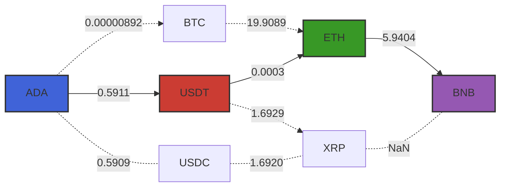

# CcyConv.jl

CcyConv is a Julia package for performing currency conversions. It allows for direct and multi-step conversions using the latest exchange 💱 rates.

## Installation
If you haven't installed our [local registry](https://github.com/bhftbootcamp/Green) yet, do that first:
```
] registry add https://github.com/bhftbootcamp/Green.git
```

To install CcyConv, simply use the Julia package manager:

```julia
] add CcyConv
```

## Usage

Here's how you can find a conversion path from `ADA` to `BNB`:



```julia
using CcyConv

crypto = FXGraph()

append!(
    crypto,
    [
        Price("ADA", "USDT", 0.5911),
        Price("ADA", "BTC", 0.00000892),
        Price("BTC", "ETH", 19.9089),
        Price("USDT", "ETH", 0.0003),
        Price("ETH", "BNB", 5.9404),
        Price("USDT", "XRP", 1.6929),
        Price("XRP", "BNB", NaN),
        Price("USDC", "XRP", 1.6920),
        Price("ADA", "USDC", 0.5909),
    ],
)

conv = conv_a_star(crypto, "ADA", "BNB")

julia> conv_value(conv)
0.0010534111319999999

julia> conv_chain(conv)
3-element Vector{CcyConv.AbstractPrice}:
 Price("ADA",  "USDT", 0.5911)
 Price("USDT", "ETH",  0.0003)
 Price("ETH",  "BNB",  5.9404)
```

The package lets you to set up a directed graph containing currencies as vertices and convert rates as edges. The graph can fill the missing data from anywhere and directly during the running conversion path calculation.

```julia
using CcyConv
using CryptoExchangeAPIs.Binance

struct MyCtx <: CcyConv.AbstractCtx
    prices::Dict{String,Float64}

    MyCtx() = new(Dict{String,Float64}())
end

struct ExSymbol <: CcyConv.AbstractPrice
    base_asset::String
    quote_asset::String
    symbol::String
end

function CcyConv.from_asset(x::ExSymbol)::String
    return x.base_asset
end

function CcyConv.to_asset(x::ExSymbol)::String
    return x.quote_asset
end

function CcyConv.price(ctx::MyCtx, x::ExSymbol)::Float64
    return get!(ctx.prices, x.symbol) do
        try
            Binance.Spot.avg_price(; symbol = x.symbol).result.price
        catch
            NaN
        end
    end
end

my_graph = FXGraph()
my_ctx = MyCtx()

append!(
    my_graph,
    [
        ExSymbol("ADA",  "BTC",  "ADABTC"),
        ExSymbol("BTC",  "USDT", "BTCUSDT"),
        ExSymbol("PEPE", "USDT", "PEPEUSDT"),
        ExSymbol("EOS",  "USDT", "EOSUSDT"),
    ],
)

my_conv = (to, from) -> conv_value(my_graph(my_ctx, CcyConv.a_star_alg, to, from))

julia> @time my_conv("ADA", "EOS")
  4.740000 seconds (1.80 M allocations: 120.606 MiB, 0.52% gc time, 14.55% compilation time)
0.6004274502578457

julia> @time my_conv("ADA", "EOS")
  0.000130 seconds (46 allocations: 2.312 KiB)
0.6004274502578457
```
