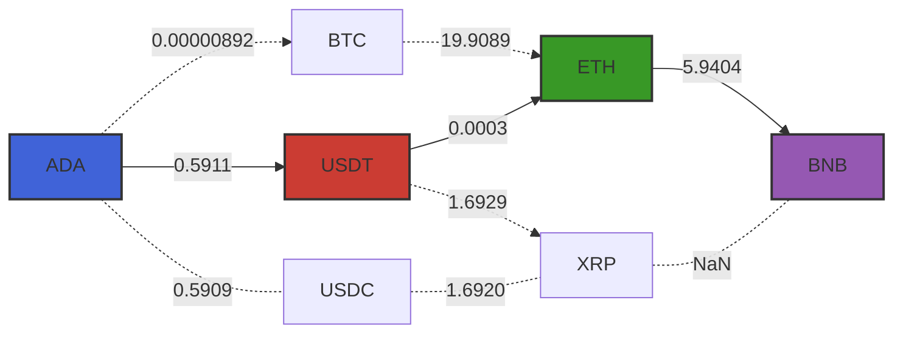

# CcyConv.jl

CcyConv is a Julia package for performing currency conversions. It allows for direct and multi-step conversions using the latest exchange 💱 rates.

## Quickstart

Here's how you can find a conversion path from `ADA` to `BNB`:



```julia
using CcyConv

crypto = FXGraph()

push!(crypto, Price("ADA",  "USDT", 0.5911))
push!(crypto, Price("ADA",  "BTC",  0.00000892))
push!(crypto, Price("BTC",  "ETH",  19.9089))
push!(crypto, Price("USDT", "ETH",  0.0003))
push!(crypto, Price("ETH",  "BNB",  5.9404))
push!(crypto, Price("USDT", "XRP",  1.6929))
push!(crypto, Price("XRP",  "BNB",  NaN))
push!(crypto, Price("USDC", "XRP",  1.6920))
push!(crypto, Price("ADA",  "USDC", 0.5909))

conv = conv_a_star(crypto, "ADA", "BNB")

julia> conv_value(conv)
0.0010534111319999999

julia> conv_chain(conv)
3-element Vector{CcyConv.AbstractPrice}:
 Price("ADA",  "USDT", 0.5911)
 Price("USDT", "ETH",  0.0003)
 Price("ETH",  "BNB",  5.9404)
```
